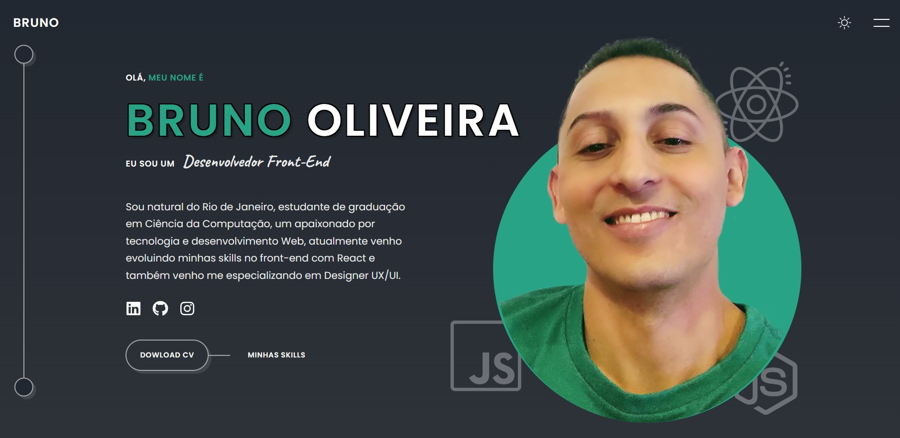

# Portfolio Profissional Bruno Oliveira




<br>

## 📎 Sumário
- 📌 Resumo do Projeto
- 🛠️ Abrir e rodar o projeto
- ⭐ Features
- 📂 Temas abordados
- ✔️ Tecnologias Utilizadas
- 💻 Demonstração
- 🙋🏻‍♂️ Autor

<br>

## 📌 Resumo do Projeto
Neste site, eu apresento o meu portfólio de design e desenvolvimento web, criado com HTML, CSS, JavaScript e React. Eu mostro os meus projetos em diferentes áreas, como web design, gráfico e ilustração. O site é responsivo e tem animações que tornam a navegação mais dinâmica e agradável.

<br>

## 🛠️ Abrir e rodar o projeto
Para Rodar o projeto em sua máquina, dentro da pasta raiz do projeto, execute o comando abaixo no terminal, para a instalação das depêndencias:
```
npm install
```
Após a instalação do projeto, execute o comando abaixo para inicializar o projeto:
```
npm start
```

<br>

## ⭐ Features

- Um design minimalista e elegante.

- Um menu de navegação que permite acessar as diferentes seções do site.

- Uma seção de home que apresenta o autor e seus serviços de forma criativa e profissional.

- Uma seção de projetos que mostra os trabalhos realizados em diferentes áreas, como web design, gráfico e ilustração.

- Uma seção de contato que oferece diferentes formas de entrar em contato, como email, telefone e redes sociais.

<br>

## 📂 Temas abordados
- HTML
- CSS
- JavaScript
- React
- Hooks
- Responsividade
- Animações
- Font Awesome
- Netlify

<br>

## ✔️ Tecnologias Utilizadas


<br>

## 💻 Demonstração
Para visualizar uma prévia do projeto <a href="https://portfolio-bruno-oliveira.netlify.app/"><b>clique aqui</b></a>

<br>

## Autor

| [<br><sub>Bruno Oliveira</sub>](https://github.com/BrunoOliveira16) |
| :---: |
